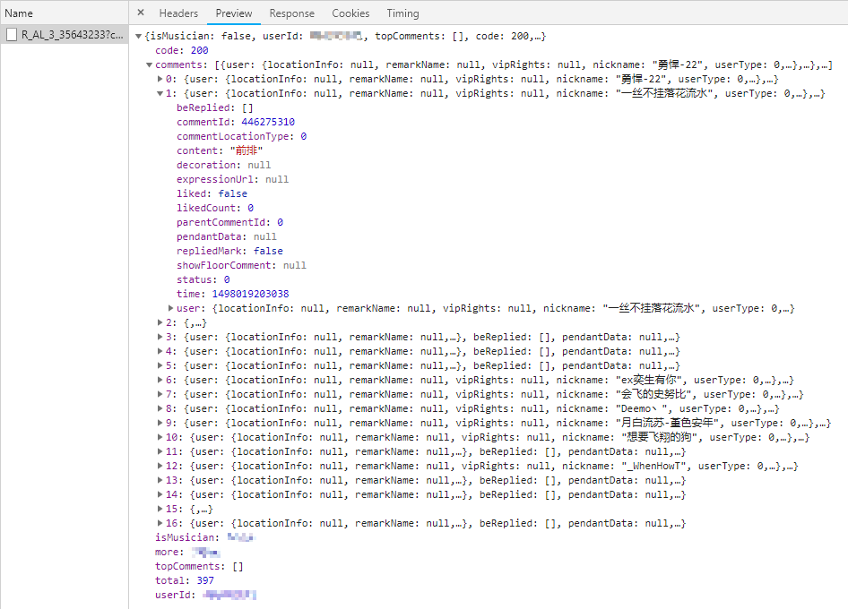
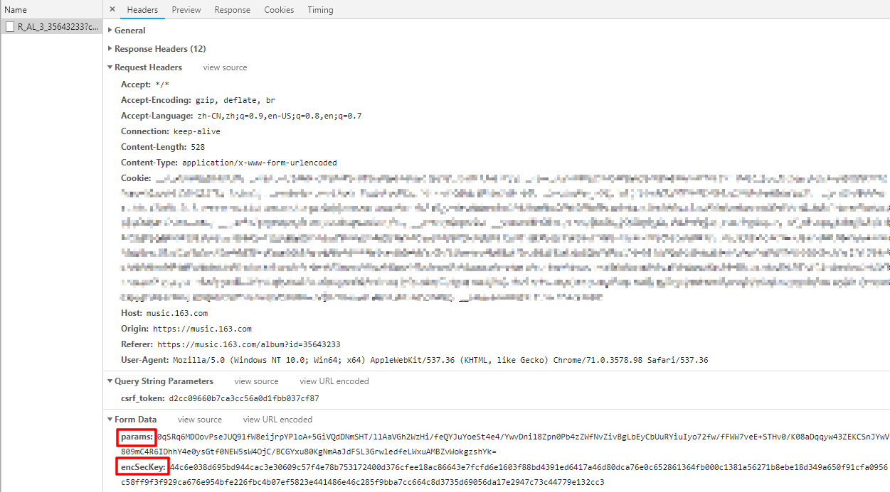

## 1. 初步分析

以 陈奕迅的专辑《放 (Budweiser EDM Remix)》[(https://music.163.com/#/album?id=35643233)](https://music.163.com/#/album?id=35643233)为例：

抓包可知，评论数据封装在 `R_AL_3_35643233?...` 中：


该包是一个 `POST` 请求，该请求带有 `params` 和 `encSecKey` 两个经过加密的变量；


重点js脚本：**core_13814ca7ae69b72c753c785e432c3f6d.js**

变量 `params` 和 `encSecKey` 是由上面脚本中的 `window.asrsea()` 函数生成的，如下所示(函数位于第90行)：

```JavaScript
var bUI1x = window.asrsea(JSON.stringify(i3x), bry4C(["流泪", "强"]), bry4C(WU8M.md), bry4C(["爱心", "女孩", "惊恐", "大笑"]));
```

> `params` 和 `encSecKey` 是 `bUI1x` 的成员

调试发现，传入 `window.asrsea()` 函数的4个变量中，后三个变量为定值，第一个变量与页数有关，`JSON.stringify(i3x)`中 `i3x` 的格式固定，如下所示：

```JavaScript
i3x = {rid: "R_AL_3_35643233", offset: "80", total: "false", limit: "20", csrf_token: "d2cc09660b7ca3cc56a0d1fbb037cf87"}
```

其中：
- `rid` 和 专辑名称 有关
- `offset` = (请求页数-1)*20
- `limit`：最大评论条数，最大值为100，
- `csrf_token` 和 Cookie 有关

> `offset` 和 `limit` 是必选参数,其他参数是可选的，其他参数不影响data数据的生成，注意 `limit` 最大值为100，当设为100时，获取下一页时，默认前一页是20个评论，也就是说第二页的评论中有20个是第一页的，最新评论只有80个。

第二个、带三个、带四个变量依次为：

```JavaScript
// bry4C(["流泪", "强"])
e = '010001'

// bry4C(WU8M.md)
f = '00e0b509f6259df8642dbc35662901477df22677ec152b5ff68ace615bb7b725152b3ab17a876aea8a5aa76d2e417629ec4ee341f56135fccf695280104e0312ecbda92557c93870114af6c9d05c4f7f0c3685b7a46bee255932575cce10b424d813cfe4875d3e82047b97ddef52741d546b8e289dc6935b3ece0462db0a22b8e7'

// bry4C(["爱心", "女孩", "惊恐", "大笑"])
g = '0CoJUm6Qyw8W8jud'
```

## 2. window.asrsea() 函数的加密过程：

在 `core_13814ca7ae69b72c753c785e432c3f6d.js` 的第 `88` 行中我们可以找到 `window.asrsea()` 函数的原型：

```JavaScript
window.asrsea = d
```

将第88行的全部代码整理如下：

``` JavaScript
!function () {

    // 函数a生成长度为16的随机字符串
    function a(a) {
        var d, e, b = "abcdefghijklmnopqrstuvwxyzABCDEFGHIJKLMNOPQRSTUVWXYZ0123456789", c = "";
        for (d = 0; a > d; d += 1)
            e = Math.random() * b.length,
            e = Math.floor(e),
            c += b.charAt(e);
        return c
    }

    // 函数b实现AES加密
    function b(a, b) {
        var c = CryptoJS.enc.Utf8.parse(b),
            d = CryptoJS.enc.Utf8.parse("0102030405060708"),
            e = CryptoJS.enc.Utf8.parse(a),
            f = CryptoJS.AES.encrypt(e, c, { iv: d, mode: CryptoJS.mode.CBC });
        return f.toString()
    }

    // 函数c实现RSA加密
    function c(a, b, c) {
        var d, e;
        return setMaxDigits(131),
               d = new RSAKeyPair(b, "", c),
               e = encryptedString(d, a)
    }

    // 函数d即为 window.asrsea() 函数
    function d(d, e, f, g) {
        var h = {}, i = a(16);
        return h.encText = b(d, g),         // 第一次AES加密
               h.encText = b(h.encText, i), // 第二次AES加密
               h.encSecKey = c(i, e, f),    // RSA加密
               h
    }

    function e(a, b, d, e) {
        var f = {};
        return f.encText = c(a + e, b, d), f
    }

    window.asrsea = d,
    window.ecnonasr = e
}();
```

函数 `window.asrsea(d, e, f, g)` 加密过程总结如下：

1. 调用函数 `a()` 生成一个随机字符串，设为 `temp1`
2. 调用函数 `b(d, g)` 进行AES加密，设加密后的变量为 `temp2`
3. 调用函数 `b(temp2, temp1)` 进行第二次AES加密，便得到 POST 请求报文中的 `params` 的值
4. 调用函数 `c(temp1, e, f)` 进行RSA加密，得到请求报文中的 `encSecKey` 的值